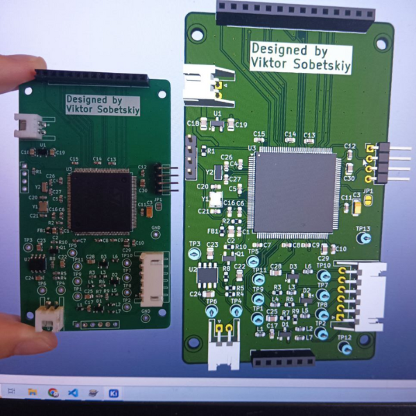

# STM32 Based VLF Metal Detector Experiment

## Introduction
The goal of this project is to develop a custom board with an STM32 microcontroller and utilize an existing commercial search coil. The working principle is as follows: a sinusoidal signal of a specific frequency is generated on the transmitting coil. The search coil is balanced so that in the absence of metal under it, the amplitude of the sinusoid on the receiving coil is minimal. If metal appears under the coil, the amplitude of the sinusoid on the receiving coil increases. The closer the metal or the larger the metal, the greater the amplitude. Additionally, it is possible to differentiate between metals by calculating the phase shift of the sinusoid on the receiving coil relative to the transmitting coil. This requires simultaneous reading of signals from both the transmitting and receiving coils, achieved using ADC dual regular simultaneous mode.

The information about the phase shift and the power of the received signal is displayed on the screen. In this project, LVGL was used to create the graphical interface.

## Project Overview
### Goals
The primary objective is to create a functioning metal detector using an STM32 microcontroller, with the capability to display signal data on a screen using LVGL. 

### Challenges
During the project, significant difficulties were encountered. When connecting the coil, the transmitted signal became distorted. This is likely due to an improperly designed matching circuit, although the exact cause was not determined. Any suggestions or ideas are welcome.

### Hardware
- **Microcontroller**: STM32H723ZGT6 was used to ensure sufficient processing power for rapid calculations. ADC1 and ADC2 were used in dual regular simultaneous mode to acquire signals from the coils. DAC was used to generate the signal for the coil and another DAC channel for sound generation.
- **Display**: A 2.8 inch display with an ILI9341 controller with a resistive touch screen on XPT2046 was used.
- **Schematic**: The schematic can be viewed in the `Hardware` folder in PDF format. [View Schematic](hardware/metal_detector_prototype.pdf)

### Software
- **Code**: The code related to this project is located in the `Program` folder.
- **Documentation**: The code is commented, and Doxygen documentation was generated. [View Doxygen Documentation](https://tor1kk.github.io/metal_detector/software/Program/Doc/html/index.html)

## Test Videos
### Working Test
A video demonstration of the working test can be found below: [View Test Video](media/test.mp4)

### Signal Distortion
A video showing the signal distortion when the coil is connected can be found below:[View Signal Distortion Video](media/signal_distortion.mp4)

## Images
### PCB Photo

## Conclusion
This project has been a valuable learning experience, despite the challenges faced. Further work is required to resolve the signal distortion issue and improve the overall performance of the metal detector.
